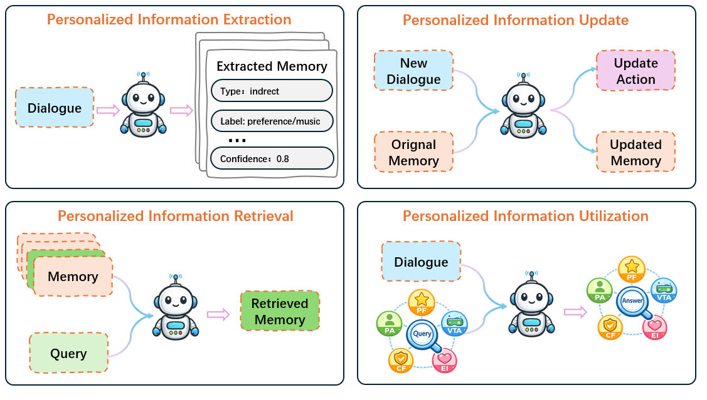
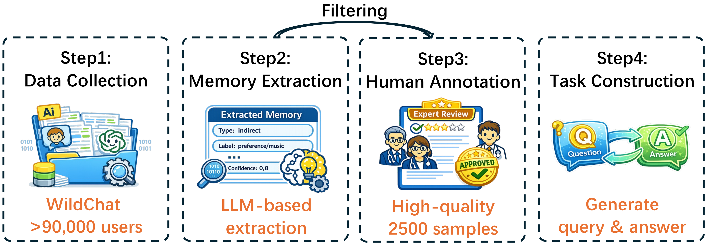

## This is the official repository of the paper[AlpsBench: An LLM Personalization Benchmark for Real-Dialogue Memorization and Preference Alignment](https://arxiv.org/abs/placeholder) and the [AlpsBench](https://huggingface.co/datasets/Cosineyx/Alpsbench) benchmark.


[](https://arxiv.org/pdf/2603.26680) [](https://misshsiaoo.github.io/Alps_Bench/) [](https://huggingface.co/datasets/Cosineyx/Alpsbench)

We present  **AlpsBench**, an LLM PerSonalization benchmark derived from real-world human–LLM dialogues. While existing benchmarks rely heavily on synthetic dialogues that exhibit a distribution gap from real-world conversations, AlpsBench bridges this gap by comprising 2,500 long-term interaction sequences curated from WildChat. These are paired with human-verified structured memories that encapsulate both explicit and implicit personalization signals.

**We systematically evaluate the entire lifecycle of memory management through four pivotal tasks:**
- **Task 1: Personalized Information Extraction** - Can LLMs reliably extract latent user traits into structured memories?
- **Task 2: Personalized Information Update** - Can LLMs track user preference dynamics and resolve conflicts?
- **Task 3: Personalized Information Retrieval** - Are LLMs robust in retrieving relevant memories from large distractor pools?
- **Task 4: Personalized Information Utilization** - Do explicit memory mechanisms inherently guarantee preference-aligned or emotionally resonant responses?

---

## Part 1: 📊 Benchmark Data & Task Introduction

<p align="center">
<!-- [PLACEHOLDER] Insert your task design / evaluation framework figure here (Figure 3 in paper) -->

</p>

We release the full benchmark data of **AlpsBench** on [🤗HuggingFace](https://huggingface.co/datasets/Cosineyx/Alpsbench). The benchmark evaluates AI assistants across four distinct tasks. Below are the task definitions and descriptions of the data files provided in the `examples/` directory.

### Task 1: Implicit Memory Extraction
- **Goal:** Evaluates the ability to extract personalized information from raw conversational data. The LLM must distill history into structured memory entries (Memory ID, Type, Label, Value, Confidence).
- **Data Format:** `examples/task1/task1_dataset.json` contains examples of raw dialogue history paired with human-annotated ground-truth memory entries.

### Task 2: Memory Update & Conflict Resolution
- **Goal:** Assesses the capacity to track dynamic user preferences. Given historical memories and a *new* dialogue, the LLM must determine the correct action: *Retention* (filtering noise), *Addition* (new preferences), or *Modification* (resolving conflicts).
- **Data Format:** `examples/task2/task2_dataset.json` demonstrates inputs of existing memory + new dialogue, with the target output being the updated memory state and specific action labels.

### Task 3: Evidence-based Memory Retrieval
- **Goal:** Measures the ability to retrieve relevant personalized information. Given a user query and a candidate set of memories (1 positive + N distractors), the model must identify the correct memory.
- **Data Format:** `examples/task3/task3_dataset_d100.json` demonstrates the setting with **100 distractors**. The full benchmark includes pools of 100, 300, 500, 700, and 1000 distractors.

### Task 4: End-to-End Personalized Generation (Utilization)
- **Goal:** Examines how well the LLM utilizes user history to generate preference-aligned responses. We break this down into 5 sub-dimensions:
  - `ability1.json` (**Persona Awareness**): Recalling explicit user attributes (e.g., occupation).
  - `ability2.json` (**Preference Following**): Inferring latent, dynamic preferences.
  - `ability3.json` (**Virtual-Reality Awareness**): Distinguishing real user info from role-play/fictional content.
  - `ability4.json` (**Constraint Following**): Respecting previously stated negative constraints.
  - `ability5.json` (**Emotional Intelligence**): Providing emotionally appropriate responses.

### 🐰 Citation
If you find our work inspires you, please consider citing it:
```bibtex
@article{xiao2026alpsbench,
  title={AlpsBench: An LLM Personalization Benchmark for Real-Dialogue Memorization and Preference Alignment},
  author={Xiao, Jianfei and Yu, Xiang and Wang, Chengbing and Zheng, Wuqiang and Lin, Xinyu and Liu, Kaining and Ding, Hongxun and Zhang, Yang and Wang, Wenjie and Feng, Fuli and He, Xiangnan},
  journal={arXiv preprint},
  year={2026}
}
```

---

## Part 2: 🚀 Running Inference on Benchmark Data

🚀 Performance Leaderboard

🚨 We evaluate 7 state-of-the-art general-purpose LLMs, including GPT-5.2, GPT-4.1-mini, DeepSeek Reasoner, Gemini-3 Flash, Llama-4 Maverick, Claude-Sonnet-4.5, and Qwen3-max across our four core tasks.

*Table: Experimental evaluation result of general-purpose LLMs (Tasks 1–4).*

| Model | Task 1<br>Extraction | Task 2<br>Update | Task 3 Retr.<br>100 | Task 3 Retr.<br>300 | Task 3 Retr.<br>500 | Task 3 Retr.<br>700 | Task 3 Retr.<br>1000 | Task 4<br>PA | Task 4 PF<br>Gen. | Task 4 PF<br>Int. | Task 4<br>VRA | Task 4<br>CF | Task 4 EI<br>EN | Task 4 EI<br>CN |
| :--- | :---: | :---: | :---: | :---: | :---: | :---: | :---: | :---: | :---: | :---: | :---: | :---: | :---: | :---: |
| **GPT-5.2** | 41.43 | **81.49** | 0.9254 | 0.9052 | 0.8884 | 0.8733 | 0.8572 | 0.5702 | 0.6983 | **0.7680** | 0.5702 | 0.5702 | 3.42 | 3.90 |
| **GPT-4.1-mini** | 33.69 | 54.66 | 0.8802 | 0.8156 | 0.7761 | 0.7482 | 0.7295 | 0.4018 | 0.4995 | 0.5240 | 0.4018 | 0.4018 | 2.79 | 2.92 |
| **DeepSeek Reasoner** | 47.79 | 80.91 | **0.9569** | **0.9484** | **0.9376** | 0.9083 | **0.9273** | 0.5825 | 0.6483 | 0.6120 | 0.5825 | **0.9602** | 3.66 | **4.00** |
| **Gemini-3 Flash** | **51.67** | 68.85 | 0.9538 | 0.9419 | 0.9342 | **0.9268** | 0.9269 | **0.6895** | **0.7655** | 0.7052 | **0.6895** | 0.8328 | 3.49 | 3.58 |
| **Llama-4 Maverick** | 22.07 | 58.84 | 0.8729 | 0.6005 | 0.5616 | 0.5141 | 0.4811 | 0.2684 | 0.1152 | 0.3080 | 0.1552 | 0.8720 | 2.48 | 2.38 |
| **Claude-Sonnet-4.5**| 41.64 | 51.25 | 0.9542 | 0.9030 | 0.9222 | 0.8999 | 0.8855 | 0.5614 | 0.6045 | 0.5498 | 0.5933 | 0.9514 | 3.10 | 3.05 |
| **Qwen3-max** | 39.01 | 76.28 | 0.9180 | 0.8669 | 0.8314 | 0.7871 | 0.7542 | 0.6228 | 0.6901 | 0.6574 | 0.6834 | 0.8267 | **3.68** | 3.84 |

> **Notes:** **PA** = Persona Awareness, **PF** = Preference Following, **VRA** = Virtual-Reality Awareness, **CF** = Constraint Following, **EI** = Emotional Intelligence. 

---

### 🔗 Dependencies & Setup
Please run the following commands to create a virtual environment and install all requirements:
```bash
conda create -n alpsbench python=3.10
conda activate alpsbench
pip install -r requirements.txt
```

API Keys Configuration:
Before running the inference scripts, please configure your API settings in api.json. You need to set the global base_url (if applicable), along with the specific model_endpoints and model_keys for the models you intend to use:
```json
{
  "base_url": "https://api.your-provider.com/v1",
  "model_endpoints": {
    "gpt-4o": "https://api.openai.com/v1/chat/completions",
    "deepseek-reasoner": "https://api.deepseek.com/chat/completions"
  },
  "model_keys": {
    "gpt-4o": "sk-...",
    "deepseek-reasoner": "sk-..."
  }
}
```


### 💻 One-Click Evaluation Scripts for Each Task

We provide ready-to-use inference scripts in the `scripts/` directory. You can specify the model (e.g., `gpt-4o`, `deepseek-reasoner`) via the `--model` argument.

**1. Evaluate Task 1 (Extraction)**
```bash
# Tests the model's ability to extract structured memories and calculates F1 score against ground truth.
python -m scripts.run_task1_inference --model gpt-4o --data_path data/task1/
```
💡 Note for Evaluating Custom Memory Systems:
If you are directly testing the extraction performance of an existing memory system (e.g., LightMem, Mem0) rather than a base LLM, use the dedicated curator script:
```bash
python -m scripts.run_task1_curator_memorysystem
```
Input File Format: Ensure your input JSON/JSONL file follows this structure, where each record contains the ground truth and the system's extracted output:
```json
{
  "ground_truth_memories": [ 
      {"memory_id": "1", "label": "...", "value": "..."} 
  ],
  "memory_items": [ 
      {"memory_id": "1", "label": "...", "value": "..."} 
  ]
}
```
**2. Evaluate Task 2 (Update)**
```bash
# Tests memory manipulation (Retention, Addition, Modification) accuracy.
python -m scripts.run_task2_inference --model gpt-4o --data_path data/task2/
```

**3. Evaluate Task 3 (Retrieval)**
```bash
# Evaluates retrieval recall. You can specify the number of distractors (e.g., 100, 300, 1000).
python -m scripts.run_task3_inference --model gpt-4o --distractors 100 --data_path data/task3/

# Evaluate traditional BM25 retrieval baseline
python -m scripts.run_task3_bm25 --distractors 100 --data_path data/task3/

# Evaluate semantic similarity retrieval baseline (Embedding Model)
python -m scripts.run_task3_embedding_model --distractors 100 --data_path data/task3/

```

**4. Evaluate Task 4 (Utilization)**
```bash
# Evaluates End-to-End generation. LLM-as-a-Judge (DeepSeek-v3.2) is used to score PA, PF, VRA, CF, and EI.
python -m scripts.run_task4_inference --model gpt-4o --judge deepseek-reasoner --data_path data/task4/
```
*Evaluation results will be automatically saved to the `results/` directory.*

---

## Part 3: 💬 Building the AlpsBench Dataset

<p align="center">
<!-- [PLACEHOLDER] Insert your 4-step curation pipeline figure here (Figure 4 in paper) -->

</p>

*Interested in how we built the real-world conversation data or want to build your own personalization benchmark? Follow our 4-step pipeline!*

### The Construction Pipeline Overview
1. **Data Collection:** Filtering long-term interaction sequences (6 to 249 turns) from the WildChat dataset.
2. **Memory Extraction & Filtering:** Using DeepSeek-v3.2 to automatically extract structured info from raw dialogues.
3. **Human Annotation:** Expert-level manual verification of extracted memories.
4. **Task Construction:** Using GPT-5.2 to synthesize task-specific queries and ground-truth answers for Tasks 1-4.

### 🛠️ One-Click Data Construction Scripts

You can reproduce our dataset or generate new data using our construction scripts. Ensure you have the raw source data placed in `data/source/`.

**Step 1 & 2: Dialogue Collection & Memory Extraction**
```bash
# Extracts memories from raw dialogues using the specified extraction model.
python construct_pipeline.py --step extract --extractor deepseek-reasoner --input data/source/wildchat.jsonl --output data/processed/extracted_memories.json
```
*(Step 3: Human Annotation is done manually offline.)*

**Step 4: Task-Specific Data Construction**
After acquiring verified memories, use the following commands to construct the specific evaluation sets for each of the four tasks:

**Construct Task 1 (Extraction Data)**

The Task 1 dataset is directly derived from the human-annotated data. No additional generation script is required. The ground truth memory entries are provided directly in the dataset.

**Construct Task 2 (Update Data)**
```bash
# Uses GPT to split dialogue into historical vs. new, and defines target update strategies (Retention, Addition, Modification).
python -m scripts.run_task2_generate
```

**Construct Task 3 (Retrieval Data)**
```bash
# Step 1: Synthesize practical user inquiries (probes) related to a target memory.
python -m scripts.run_task3_generate

# Step 2: Inject negative distractor memories to build the final scaled test datasets.
# Note: You can adjust the DISTRACTOR_COUNT within run_task3_distractor.py (e.g., 100, 300, 1000).
python -m scripts.run_task3_distractor
```

**Construct Task 4 (Utilization Data)**
```bash
# Generates task queries across the 5 dimensions (PA, PF, VRA, CF, EI) along with ground-truth answers.
python -m scripts.run_task3_generate
```
